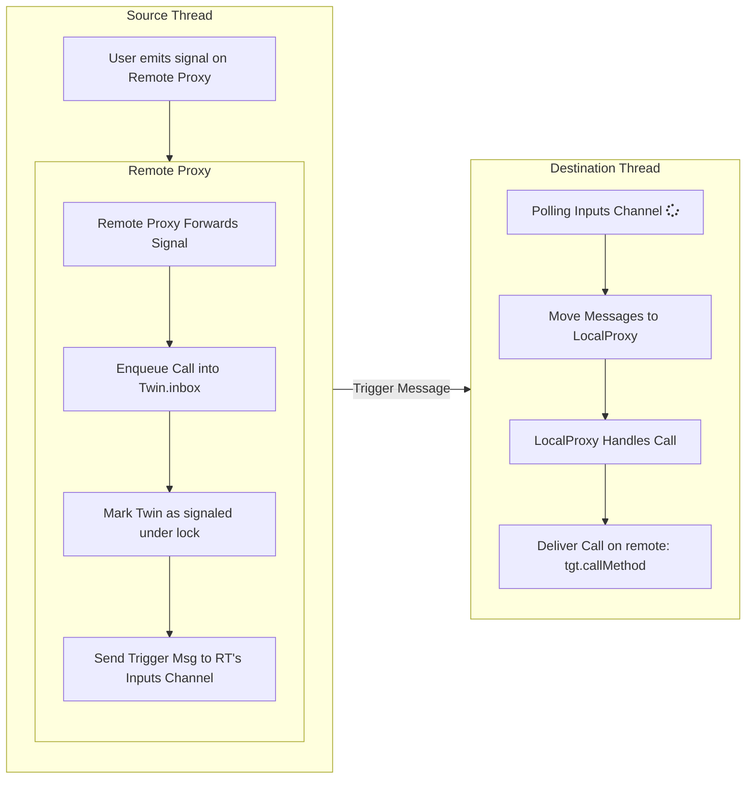
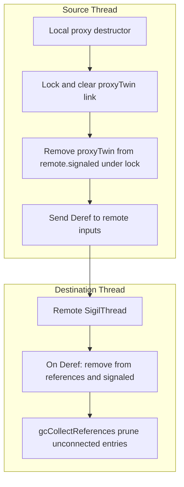

# Sigils Threading Architecture

This document explains the threading architecture implemented in `sigils/threads.nim`, `sigils/threadBase.nim`, and `sigils/threadProxies.nim`, with examples from `tests/tslotsThread.nim`. It focuses on how agents are moved across threads, how calls and signals travel safely between threads, and the guarantees and caveats for thread and async safety.

## Overview

- Sigils uses a message-passing model to keep agent logic thread-confined while enabling cross-thread signaling.
- Agents can be **moved** to a worker thread; callers interact with them through a local proxy (`AgentProxy[T]`).
- Cross-thread calls are delivered over channels and a small scheduler loop on the target thread.
- Cleanup is synchronized: moved agents are owned by the destination thread, and cross-thread references are tracked and dereferenced via messages to the remote thread. When all remote proxies are destructed the moved agent will be destroyed as well.

## Core Types

- `SigilThread`/`SigilThreadImpl` (threadBase): Encapsulates a worker thread and its scheduling state. Holds:
  - `inputs: Chan[ThreadSignal]` main control channel for the thread.
  - `signaled: HashSet[WeakRef[AgentRemote]]` set of per-proxy mailboxes to drain.
  - `signaledLock: Lock` protects `signaled`.
  - `references: Table[WeakRef[Agent], Agent]` ownership table of agents moved onto this thread.
  - `agent: ThreadAgent` a local agent for thread lifecycle signals (e.g., `started`).
  - `running: Atomic[bool]`, `threadId: Atomic[int]`.

- `ThreadSignal` (threadBase): Control and invocation messages routed to threads.
  - `Call(slot, req, tgt)` — invoke `slot` on `tgt` with `req`.
  - `Move(item)` — move an `Agent` (or proxy) to the thread; stored in `references`.
  - `Trigger` — instructs the scheduler to drain signaled proxy inboxes.
  - `Deref(deref)` — drop a reference previously `Move`-ed to this thread.
  - `Exit` — stop the scheduler loop.

- `AgentRemote` (threadBase): A mailbox-capable agent base with `inbox: Chan[ThreadSignal]`. Proxies extend this to implement per-proxy mailboxes.

- `AgentProxy[T]`/`AgentProxyShared` (threadProxies): Twin proxies mediating cross-thread communication.
  - `remote: WeakRef[Agent]` — the actual agent (lives on remote thread after move).
  - `proxyTwin: WeakRef[AgentProxyShared]` — the opposite-side proxy.
  - `remoteThread: ptr SigilThread` — the thread that should execute work.
  - `lock: Lock` — protects proxy twin access and local proxy state.

## Moving Agents Across Threads

`moveToThread(agent, thread)` (threadProxies):

- Preconditions: `agent` must be unique (`isUniqueRef`) to prevent sharing GC refs across threads.
- Creates two proxies:
  - `localProxy` — lives on the current thread; used by local code to talk to the remote agent.
  - `remoteProxy` — lives on the destination thread; used to forward events back to the local side.
- Rewrites subscriptions:
  - Outbound (agent listening to others): rebinds listeners so the local proxy receives those signals and forwards across threads.
  - Inbound (others listening to agent): rebinds so callers attach to `localProxy`; the remote agent publishes to `remoteProxy`, which forwards back.
- Ownership transfer:
  - Sends `Move(agent)` and `Move(remoteProxy)` to the destination thread so they are owned (and managed) by that thread’s `references` table.
- Returns `localProxy` to the caller; the original `agent` variable is moved (becomes `nil`).

The tests demonstrate this flow, e.g.:

- `let bp: AgentProxy[Counter] = b.moveToThread(thread)`
- Subsequent `connect(...)` calls attach to `bp` (local proxy) while execution runs on `thread`.

## Message Flow and Scheduling

Two paths deliver work on the destination thread:

1) Per-proxy mailbox path (dominant path)
- The sender enqueues a `Call` into `proxyTwin.inbox` (the twin on the destination thread).
- The sender marks the twin as signaled in `remoteThread.signaled` under `signaledLock`.
- The sender posts `Trigger` to `remoteThread.inputs`.
- The scheduler handles `Trigger` by moving `signaled` into a local set, then for each signaled proxy drains its `inbox` with `tryRecv` and invokes `tgt.callMethod(req, slot)`.

2) Direct control path
- `Move`, `Deref`, and `Exit` are posted to `remoteThread.inputs` and handled immediately.
- `Call` is also supported on `inputs` (threadBase), though proxy code primarily uses per-proxy inbox + `Trigger`.

All cross-thread messages are isolated (`isolateRuntime`) before enqueueing to ensure thread-safe transfer of data.

## Proxy Call Semantics

`AgentProxyShared.callMethod(req, slot)` routes calls based on `slot`:

- `slot == remoteSlot` — event forwarding from the remote agent back to the local side.
  - Wraps as `Call(localSlot, req, tgt = proxyTwin)` and enqueues into `proxyTwin.inbox` on the other thread with `Trigger`.

- `slot == localSlot` — local delivery on the receiving side.
  - Executes `callSlots(self, req)` to fan out to local subscribers.

- Otherwise — regular slot call bound for the remote agent.
  - Wraps as `Call(slot, req, tgt = proxy.remote)`, enqueues into `proxyTwin.inbox` (on remote), and `Trigger`s the remote thread.

Locks are used to safely access `proxyTwin` and to coordinate with the destination thread’s `signaled` set.

## Thread Loop and Lifecycle

- `runForever(thread)` loops while `running` is true, calling `poll()` to receive and execute one `ThreadSignal` at a time (catching exceptions via `exceptionHandler` if set).
- `Trigger` drains signaled proxy inboxes.
- `Move` takes ownership of agents/proxies (store in `references`).
- `Deref` removes owned references and clears any `signaled` entries for that proxy.
- `Exit` sets `running = false` to end the loop.

Helpers:
- `newSigilThread()` allocates/initializes a `SigilThreadImpl`.
- `start()/stop()/join()/peek()` manage worker threads.
- `startLocalThread()/getCurrentSigilThread()` manage a thread-local `SigilThread` for the current (often main) thread.

## Destruction and Cleanup

- Agents have a destructor (`destroyAgent`) that removes them from all subscriptions and listeners. Debug builds assert destruction happens on the owning thread (`freedByThread` checks).
- Proxies break cycles on destruction:
  - `AgentProxyShared.=destroy` clears the opposite twin’s link under `lock`, removes it from the remote thread’s `signaled`, and posts a `Deref` to drop the remote reference.
  - Destroys local `lock` and `remoteThread` refs last.
- The destination thread periodically cleans `references` via `gcCollectReferences()` (after `Deref`), removing entries for agents that have no connections.

## Using From Tests (tslotsThread.nim)

Patterns illustrated by the tests:

- Direct cross-thread emit via a `WeakRef`: build a request in a background thread and deliver it back to main via a channel, then `emit resp` on the main thread.
- Moving and connecting:
  - Move `Counter` to a worker thread, hold `AgentProxy[Counter]` locally.
  - `threads.connect(a, valueChanged, bp, setValue)` wires signal `a.valueChanged` to the remote `bp.setValue()`; the handler runs on the worker thread.
  - Use `getCurrentSigilThread()[].poll()` or `pollAll()` on the local thread to process inbound forwarded events.
- Thread lifecycle signals:
  - `connect(thread[].agent, started, bp.getRemote()[], ticker)` to run a slot when the remote thread starts.
- Assertions about subscription topology are used to verify that proxies have the expected inbound/outbound connections after `moveToThread`.

## Thread Safety Notes

- Ownership: After `moveToThread`, the destination thread exclusively owns the moved agent (and its `remoteProxy`) via `references`. Do not retain or use the original agent ref on the source thread.
- Isolation: Cross-thread messages isolate (`isolateRuntime`) their payloads; slot/param types must be isolatable or moved safely.
- No shared GC refs: The code defends against sharing by requiring unique refs before move and by using `WeakRef` identifiers for cross-thread targeting.
- Synchronization:
  - `signaled` guarded by `signaledLock`.
  - Proxy internals guarded by `lock` when accessing `proxyTwin` and scheduling signals.
  - Atomic fields (`running`, `threadId`) avoid data races.
- Backpressure: `newChan[ThreadSignal](1_000)` for per-proxy inbox and thread inputs. Non-blocking send (`trySend`) raises `MessageQueueFullError` when full.

## Async Safety Notes

- The base API documented here is thread-centric. For integration with `asyncdispatch`, use the async variant in `sigils/threadAsyncs.nim` (`AsyncSigilThread`). It:
  - Replaces the blocking loop with an `AsyncEvent` callback that drains signals during the event loop.
  - Triggers the event on every send/recv to schedule work.
  - Provides `start/stop/join/peek` analogous to the blocking version.
- Do not run async operations on a thread that is not running an event loop; use `AsyncSigilThread` for agents that must interact with async APIs.

## Gotchas and Best Practices

- Always check uniqueness before moving (`moveToThread` enforces this and raises on violation).
- After moving, update all connections through the returned `AgentProxy[T]`; direct references to the old agent are invalid on the source thread.
- Use `threads.connect(...)` overloads when connecting to a proxy to ensure correct signal/slot typing and thread routing.
- Poll the local thread (`poll`/`pollAll`) when expecting inbound events forwarded from a worker thread.
- Consider setting a custom `exceptionHandler` on threads used in tests or long-running services to surface handler exceptions clearly.
- In debug builds, heed `freedByThread` assertions; they catch cross-thread destruction misuse.

## Minimal Example

```nim
let t = newSigilThread()
t.start()
startLocalThread()

var src = SomeAction.new()
var dst = Counter.new()
let p: AgentProxy[Counter] = dst.moveToThread(t)

threads.connect(src, valueChanged, p, setValue)

emit src.valueChanged(42)
getCurrentSigilThread()[].pollAll()  # drain local events
```

This schedules `Counter.setValue` on `t` and keeps all cross-thread traffic safe through the proxy and thread scheduler.

## Diagrams

The following Mermaid flowcharts illustrate the key event flows.

### Call: local to remote via AgentProxy



  Deliver --> Back{Remote emits a signal};
  Back -- Yes --> WrapBack[Wrap via remoteSlot to localSlot for other side];
  WrapBack --> EnqueueBack[Enqueue to other side inbox and Trigger];
  Back -- No --> Done[Done];
### Deref: proxy and agent teardown


