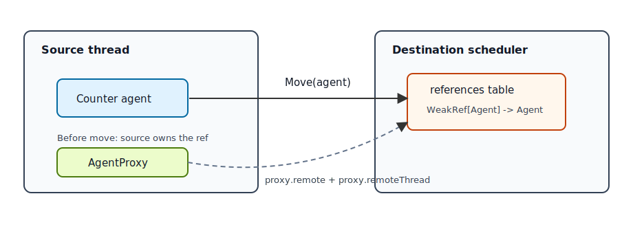
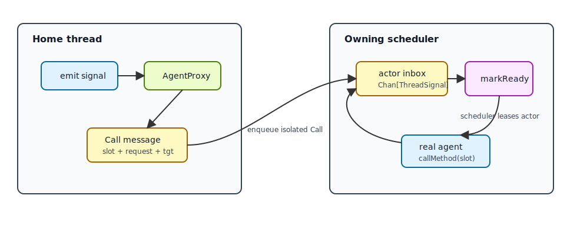
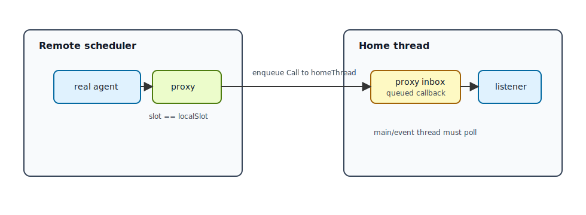
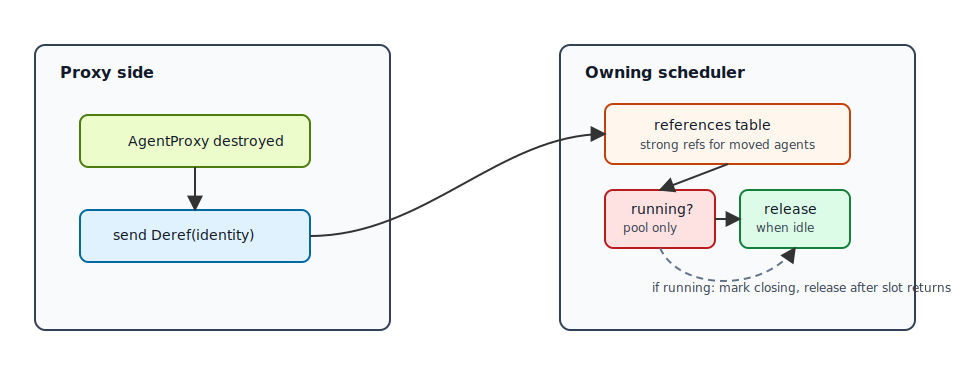

# Sigils Threading

Sigils uses message passing to keep agent state owned by one scheduler at a
time. A moved agent is not shared between threads. The original ref is moved
into the destination scheduler, and the caller keeps an `AgentProxy[T]` that
knows how to send work to the real agent.

That design gives the important safety rule:

> Agent methods run on the scheduler that owns the real agent. Other threads
> talk to that agent through messages and proxies.

This document focuses on the core mechanics: `AgentProxy`, `Move`, `Deref`,
per-agent inboxes, and the lifetime rules that keep cross-thread calls safe.

## The Main Pieces

- `AgentActor` is an agent with a mailbox (`inbox`) and a lock around its
  subscription lists.
- `SigilThread` is the scheduler base type. It owns moved agents in
  `references: Table[WeakRef[Agent], Agent]`.
- `SigilThreadDefault` is the normal one-worker scheduler. It receives
  `ThreadSignal`s on `inputs` and executes them serially in `runForever()`.
- `SigilThreadPool` is a cooperative worker pool. It is still a `SigilThread`,
  but it leases one actor at a time so one actor is never run by two workers at
  once.
- `AgentProxy[T]` is the local handle returned by `moveToThread`. It has:
  `remote`, `remoteThread`, `homeThread`, and a local subscription list.
- `ThreadSignal` is the scheduler message type. The important variants are
  `Move`, `Call`, `Trigger`, `Deref`, `AddSub`, `DelSub`, and `Exit`.

The thread-local current scheduler is available through
`getCurrentSigilThread()`. Worker threads set this automatically. A main thread
that receives callbacks from workers must poll its local scheduler with
`poll()` or `pollAll()`.

## Ownership Model

Moving an agent is a transfer of the strong ref. After `moveToThread`, caller
code should treat the original variable as gone and use only the returned proxy.



The move is implemented by `moveToThread(agent, thread)`:

1. It requires the agent ref to be unique. If the ref is still shared,
   `moveToThread` raises instead of creating a cross-thread GC alias.
2. It creates an `AgentProxy[T]` on the current thread.
3. It rewrites subscriptions so local callers target the proxy and remote
   signals can be forwarded back to local listeners.
4. It sends `ThreadSignal(kind: Move, item: move agent)` to the destination.
5. The destination scheduler stores the moved strong ref in `references`.

The proxy keeps only weak identity for the real agent. The scheduler owns the
strong ref.

## How A Proxy Sends A Call

A proxy does not call the real agent directly. It packages the slot call as a
`ThreadSignal(Call)`, puts it in the target actor inbox, and asks the remote
scheduler to make that actor ready.



For `SigilThreadDefault`, `markReady` records the actor in `signaled` and
sends `Trigger`. When the scheduler receives `Trigger`, it drains each signaled
actor inbox and runs the calls serially.

For `SigilThreadPool`, `markReady` puts the actor identity in the pool ready
queue. A worker leases that actor, runs one call, releases the lease, and
requeues the actor if more inbox work is waiting. That is what allows many
actors to run in parallel while preserving single-actor serialization.

## Signals Back To The Home Thread

Remote-to-local delivery uses the same proxy in the opposite direction. When a
remote agent emits a signal that has local subscribers, the remote agent's
subscription points at the proxy with the sentinel `localSlot`. Calling that
proxy from the remote scheduler means "send this back to the proxy's home
thread."



This is why local threads need a scheduler too. If the home thread is a UI or
main thread, call `getCurrentSigilThread().pollAll()` at appropriate points to
deliver callbacks.

## Lifetime And Cleanup

The scheduler's `references` table is the strong owner for moved agents. Cross
thread queues and proxies should carry weak identities and isolated request
payloads, not long-lived strong refs.



`Deref` is a scheduler message, not a direct free from another thread. Its
meaning is:

- If the scheduler owns a strong ref for that identity, remove it from
  `references`.
- Clear stale readiness/signaled state for that identity.
- Run cleanup that prunes owned agents which no longer have connections.
- In `SigilThreadPool`, if the actor is currently leased by a worker, mark it
  `closing` and release the strong ref only after the slot returns.

That last point is important. A worker must never run a slot through a weak ref
after the scheduler has released the strong owner. The pool separates logical
close (`closing = true`) from physical release (`references.del(...)`) so
`Deref` cannot free a currently executing actor.

Global registration is another lifetime case. The registry installs a
keep-alive subscription with `AddSub` and removes it with `DelSub`. That keeps a
registered remote agent alive even if a local proxy is short-lived.

## Subscription Rewriting

`moveToThread` also rewrites existing connections so later signal delivery goes
through the proxy:

- If other agents listened to the moved agent, they now listen to the local
  proxy.
- If the moved agent listened to other local agents, those local agents now call
  the proxy, which forwards to the remote agent.
- When local code subscribes to a signal on the proxy, the proxy ensures the
  remote agent has a forwarding subscription back to the proxy using
  `localSlot`.

The proxy's local subscription list is therefore the stable API surface. Users
connect to the proxy; the proxy arranges the cross-thread forwarding details.

## Default Thread vs Thread Pool

Both schedulers implement the same `SigilThread` API, so `moveToThread` and
`AgentProxy` work with either one.

`SigilThreadDefault`:

- One OS thread owns all moved agents for that scheduler.
- `Trigger` drains every signaled actor inbox serially.
- It is simple and predictable: no two slots on that scheduler run at once.

`SigilThreadPool`:

- Several OS workers share one scheduler state and one ownership table.
- The ready queue contains actor identities, not individual calls.
- A worker leases one actor, executes one call, releases it, and requeues the
  actor if more work exists.
- The same actor is never leased by two workers at the same time.
- Different actors can run on different workers in parallel.

## Practical Example

```nim
import sigils
import sigils/threads

let worker = newSigilThread()
worker.start()

let home = getCurrentSigilThread()

var source = SomeAction.new()
var counter = Counter.new()
let counterProxy = counter.moveToThread(worker)

connectThreaded(source, valueChanged, counterProxy, setValue)
connectThreaded(counterProxy, updated, source, SomeAction.completed())

emit source.valueChanged(42)

# Required if this thread receives callbacks from the worker.
discard home.pollAll()

worker.setRunning(false)
worker.join()
```

After `moveToThread`, use `counterProxy` for all cross-thread connections. Do
not keep using the moved `counter` ref on the source thread.

## Safety Checklist

- Move only unique refs. `moveToThread` enforces this with `isUniqueRef`.
- Treat the returned `AgentProxy[T]` as the handle to the remote agent.
- Use `connectThreaded` for cross-thread signals and slots.
- Keep signal payloads thread-safe. Cross-thread `ThreadSignal`s are isolated
  with `isolateRuntime`.
- Poll the home scheduler when it needs to receive callbacks.
- Stop and join worker schedulers in tests and short-lived programs.
- Use the registry keep-alive helpers when a remote agent must outlive one local
  proxy.

## Things To Avoid

- Do not call methods on the moved agent ref after `moveToThread`.
- Do not store strong moved-agent refs in worker-local queues. Queue weak actor
  identities and let the scheduler's `references` table own the agent.
- Do not assume `Deref` is an immediate cross-thread destructor. It is a
  scheduler request and may be deferred until a running slot finishes.
- Do not forget to pump the home thread when expecting remote-to-local signals.

## Related Files

- `sigils/threadBase.nim`: scheduler base type, `ThreadSignal`, `Move`,
  `Deref`, `markReady`, polling, and default execution logic.
- `sigils/threadDefault.nim`: one-thread scheduler implementation.
- `sigils/threadPool.nim`: cooperative worker pool scheduler.
- `sigils/threadProxies.nim`: `AgentProxy`, `moveToThread`, and
  `connectThreaded`.
- `sigils/actors.nim`: `AgentActor` inbox and subscription locking.
- `tests/tslotsThread.nim` and `tests/tthreadPool.nim`: examples and coverage.
