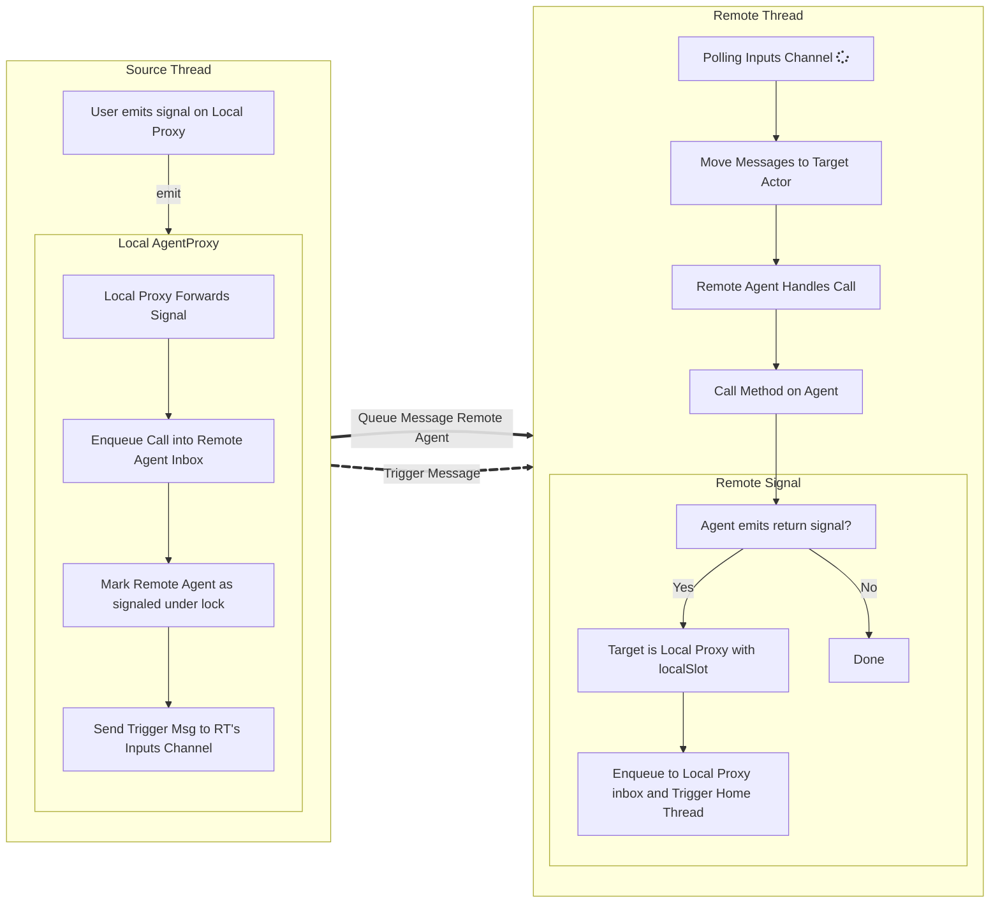
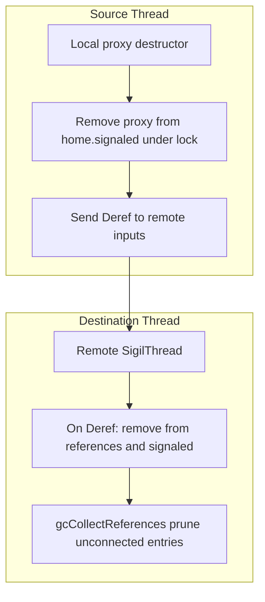

# Sigils Threading Architecture

This document explains the threading architecture implemented in `sigils/threadBase.nim`, `sigils/threadDefault.nim`, and `sigils/threadProxies.nim` (re-exported via `sigils/threads.nim`), with examples from `tests/tslotsThread.nim`. It focuses on how agents are moved across threads, how calls and signals travel safely between threads, and the key safety guarantees and caveats.

At a high level, Sigils follows a "don't share, communicate" approach to concurrency. Each thread is treated as the exclusive owner of the agents it runs: an agent's internal state is meant to be read and written by only one thread. Instead of letting multiple threads call into the same object directly (which would require locks around every access), Sigils keeps agent code single-threaded and uses message passing to request work from other threads.

The key operation is a move. Moving an agent to another thread is an ownership transfer: after the move, the destination thread is the only place where the real agent lives and executes. The source thread should behave as if it no longer has the agent at all. What it keeps is a small local stand-in whose job is to forward method calls and signals across threads. This is similar in spirit to moving an object to another process and then talking to it through a handle.

Communication is built around inboxes (message queues). When code on one thread wants something to happen on another thread, it packages the request as a message and puts it into the destination thread's inbox. The destination thread runs a simple loop: it repeatedly takes messages out of its inbox and executes them one at a time. Because all requests are handled serially on the owning thread, the agent doesn't need internal locking to stay consistent.

Signals travel back the same way. When an agent running on a worker thread emits a signal that has listeners on a different thread, that signal becomes a message placed into the other thread's inbox. Importantly, the receiving thread must periodically drain its own inbox to deliver those callbacks. If you forget to pump the inbox on the receiving side, cross-thread signals won't be observed even though they were queued.

## Overview

- Sigils uses a message-passing model to keep agent logic thread-confined while enabling cross-thread signaling.
- Agents can be **moved** to a worker thread; callers interact with them through a local proxy that forwards requests.
- Cross-thread work is executed by a per-thread scheduler that processes messages serially.
- Worker threads run the scheduler loop automatically; threads without a built-in loop must periodically poll to process forwarded events.
- Cleanup is synchronized: moved agents are owned by the destination thread, and proxies send dereference messages so the destination thread can release remote state.
- Subscriptions and slots are configured on the local proxy.

## Mental Model

- Every participating OS thread has a thread-local `SigilThread` (`getCurrentSigilThread()` in `sigils/threadBase.nim`).
- A `SigilThread` executes messages serially; there is no parallel execution within a single `SigilThread`.
- `SigilThreadDefault.start()` spawns a worker that calls `runForever()` and blocks in `poll()`.
- If your current thread needs to receive events from other threads, you must pump its scheduler by calling `poll()`/`pollAll()` periodically.

## Core Types

- `SigilThread` (threadBase): Common scheduler/state shared by all thread implementations. Holds:
  - `signaled: HashSet[WeakRef[AgentActor]]` set of inboxes to drain.
  - `signaledLock: Lock` protects `signaled`.
  - `references: Table[WeakRef[Agent], Agent]` ownership table of agents moved onto this thread.
  - `agent: SigilThreadAgent` a local agent for thread lifecycle signals (e.g., `started`).
  - `exceptionHandler` invoked by `runForever()` if a slot raises.
  - `running: Atomic[bool]`, `threadId: Atomic[int]`.

- `SigilThreadDefault` (threadDefault): Default blocking worker thread implementation. Adds:
  - `inputs: Chan[ThreadSignal]` main control channel for `Move`/`Deref`/`Trigger`/`Call`/`Exit`.
  - `thr: Thread[ptr SigilThreadDefault]` OS thread handle.

- Thread-local access (threadBase):
  - `localSigilThread {.threadVar.}` stores the current scheduler pointer.
  - `getCurrentSigilThread()` lazily initializes it by calling `startSigilThreadProc` (defaults to `startLocalThreadDefault()` from `sigils/threadDefault.nim`).

- `ThreadSignal` (threadBase): Control and invocation messages routed to threads.
  - `Call(slot, req, tgt)` — invoke `slot` on `tgt` with `req`.
  - `Move(item)` — move an `Agent` (or proxy) to the thread; stored in `references`.
  - `Trigger` — instructs the scheduler to drain signaled proxy inboxes.
  - `Deref(deref)` — drop a reference previously `Move`-ed to this thread and prune dead `references`.
  - `Exit` — stop the scheduler loop.

- `AgentActor` (actors): Mailbox-capable agent base with `inbox: Chan[ThreadSignal]` and a lock for thread-safe subscription updates.

- `AgentProxy[T]`/`AgentProxyShared` (threadProxies): A single local proxy that mediates cross-thread communication.
  - `remote: WeakRef[AgentActor]` — the real agent (owned by the destination thread after a move).
  - `remoteThread: SigilThreadPtr` — scheduler for the thread that owns `remote`.
  - `homeThread: SigilThreadPtr` — scheduler for the thread that owns the proxy.
  - `forwarded: HashSet[SigilName]` — signals currently forwarded from `remote` to the proxy.

## Moving Agents Across Threads

`moveToThread(agent, thread)` (threadProxies):

- Preconditions: `agent` must be unique (`isUniqueRef`) to prevent sharing GC refs across threads.
- Creates a single proxy:
  - `localProxy` — lives on the current thread; used by local code to talk to the remote agent.
- Rewrites subscriptions:
  - Outbound (agent listening to others): rebinds listeners so the local proxy receives those signals and forwards across threads.
  - Inbound (others listening to agent): rebinds callers to `localProxy`; the proxy arranges direct forwarding by adding thread-safe subscriptions on the remote agent using `localSlot`.
- Ownership transfer:
  - Sends `Move(agent)` to the destination thread so it is owned (and managed) by that thread's `references` table.
- Returns `localProxy` to the caller; the original `agent` variable is moved (becomes `nil`).

The tests demonstrate this flow, e.g.:

- `let bp: AgentProxy[Counter] = b.moveToThread(thread)`
- Subsequent `connect(...)` calls attach to `bp` (local proxy) while execution runs on `thread`.

## Message Flow and Scheduling

Two paths deliver work on the destination thread:

1) Per-actor mailbox path (dominant path)
- The sender enqueues a `Call` into the target `AgentActor.inbox` on the destination thread.
- The sender marks that target as signaled in `remoteThread.signaled` under `signaledLock`.
- The sender posts `Trigger` to `remoteThread` (via `remoteThread.send(ThreadSignal(kind: Trigger))`).
- The scheduler handles `Trigger` by moving `signaled` into a local set, then for each signaled actor drains its `inbox` with `tryRecv` and invokes `tgt.callMethod(req, slot)`.

2) Direct control path
- `Move`, `Deref`, and `Exit` are sent to the destination thread via `thread.send(...)` and handled immediately.
- `Call` is also supported as a direct `ThreadSignal(Call)` on a thread's input channel (used by `connectQueued`), though proxy code primarily uses per-proxy inbox + `Trigger`.

All cross-thread messages are isolated (`isolateRuntime`) before enqueueing to ensure thread-safe transfer of data.

## Proxy Call Semantics

`AgentProxyShared.callMethod(req, slot)` routes calls based on the current thread and `slot` sentinel values:

- If invoked off the proxy's `homeThread` (i.e. called from the remote thread):
  - Enqueues `Call(slot, req, tgt = proxy)` into the proxy's inbox, signals the home thread, and posts `Trigger`.

- `slot == localSlot` (and `remoteSlot` for legacy callers) — local delivery on the receiving side.
  - Executes `callSlots(self, req)` to fan out to local subscribers.

- Otherwise — regular slot call bound for the remote agent.
  - Wraps as `Call(slot, req, tgt = proxy.remote)`, enqueues into the remote agent inbox, and `Trigger`s the remote thread.

**Note**:
  The local proxy owns the subscription list and forwards specific signals by installing
  direct subscriptions on the remote agent (thread-safe via `AgentActor`'s lock). This
  removes the need for a separate remote router or wildcard `AnySigilName`.

Locks are used to safely access proxy state and to coordinate with the destination thread's `signaled` set.

## Thread Loop and Lifecycle

- `runForever(thread)` loops while `running` is true, calling `poll()` to receive and execute one `ThreadSignal` at a time (catching exceptions via `exceptionHandler` if set).
- `Trigger` drains signaled proxy inboxes.
- `Move` takes ownership of agents/proxies (store in `references`).
- `Deref` removes owned references and clears any `signaled` entries for that proxy.
- `Exit` sets `running = false` to end the loop.

Helpers:
- `newSigilThread()` allocates/initializes a `SigilThreadDefault`.
- `start()/join()/peek()` manage the worker OS thread.
- `setRunning(false)` (or sending `Exit`) stops `runForever()` for a thread.
- `startLocalThreadDefault()` and `getCurrentSigilThread()` manage a thread-local `SigilThread` for the current (often main) thread; `getCurrentSigilThread()` is lazy and will call `startSigilThreadProc` if needed.

## Queued Calls (Same Thread)

`connectQueued(...)` routes a signal to a slot by enqueueing a `ThreadSignal(Call)` onto the current thread's `SigilThread` instead of calling inline. The slot runs the next time you `poll()`/`pollAll()` that thread.

Because it uses `SigilThread.send(...)` under the hood, the queued `ThreadSignal` is still passed through `isolateRuntime(...)` before it is enqueued.

## Destruction and Cleanup

- Agents have a destructor (`destroyAgent`) that removes them from all subscriptions and listeners. Debug builds assert destruction happens on the owning thread (`freedByThread` checks).
- Proxies break cycles on destruction:
  - `AgentProxyShared.=destroy` removes the proxy from the home thread's `signaled` set and posts a `Deref` to the remote thread to drop any remaining references.
  - Destroys local `lock` and `remoteThread` refs last.
- The destination thread periodically cleans `references` via `gcCollectReferences()` (after `Deref`), removing entries for agents that have no connections.

## Using From Tests (tslotsThread.nim)

Patterns illustrated by the tests:

- Direct cross-thread emit via a `WeakRef`: build a request in a background thread and deliver it back to main via a channel, then `emit resp` on the main thread.
- Moving and connecting:
  - Move `Counter` to a worker thread, hold `AgentProxy[Counter]` locally.
  - `connectThreaded(a, valueChanged, bp, setValue)` wires signal `a.valueChanged` to the remote `bp.setValue()`; the handler runs on the worker thread.
  - `connectThreaded(bp, updated, a, SomeAction.completed())` wires the remote signal back to a local slot (and demonstrates that the local thread must be polled).
  - Use `getCurrentSigilThread().poll()` or `pollAll()` on the local thread to process inbound forwarded events.
- Thread lifecycle signals:
  - `connectThreaded(thread, started, bp, ticker)` to run a remote slot when the worker thread starts (emitted by `thread[].agent.started()` in `runForever()`).
- Assertions about subscription topology are used to verify that proxies have the expected inbound/outbound connections after `moveToThread`.

## Thread Safety Notes

- Ownership: After `moveToThread`, the destination thread exclusively owns the moved agent via `references`. Do not retain or use the original agent ref on the source thread.
- Isolation: Cross-thread `ThreadSignal`s are passed through `isolateRuntime(...)` before enqueueing. If the payload contains non-unique `ref`s, `isolateRuntime` raises `IsolationError` to prevent unsafe sharing.
- Signal params: Cross-thread signal parameter types must be thread-safe (no `ref` fields). The `connectThreaded` helpers use `checkSignalThreadSafety` for common patterns; use `Isolate[T]` for heap payloads you need to transfer.
- No shared GC refs: The code defends against sharing by requiring unique refs before move and by using `WeakRef` identifiers for cross-thread targeting.
- Synchronization:
  - `signaled` guarded by `signaledLock`.
  - Proxy internals guarded by `lock` when accessing proxy state and scheduling signals.
  - Atomic fields (`running`, `threadId`) avoid data races.
- Backpressure: `newChan[ThreadSignal](1_000)` for per-actor inbox and thread inputs. Non-blocking send (`trySend`) raises `MessageQueueFullError` when full.

## Async Safety Notes

- The base API documented here is thread-centric. For integration with `asyncdispatch`, use the async variant in `sigils/threadAsyncs.nim` (`AsyncSigilThread`) (not currently re-exported by `sigils/threads.nim`, so import it directly). It:
  - Uses an `AsyncEvent` callback to drain signals during the event loop.
  - Triggers the event on every send/recv to schedule work.
  - Implements `setTimer` via `asyncdispatch.addTimer` (timers are not implemented by `SigilThreadDefault`).
- To make `getCurrentSigilThread()` create an async scheduler for the current thread, call `setStartSigilThreadProc(startLocalThreadDispatch)` (or call `startLocalThreadDispatch()` manually).

## Gotchas and Best Practices

- Always check uniqueness before moving (`moveToThread` enforces this and raises on violation).
- After moving, update all connections through the returned `AgentProxy[T]`; direct references to the old agent are invalid on the source thread.
- Use `connectThreaded(...)` when wiring signals across threads; it validates thread-safety and routes through the proxy correctly.
- Poll the local thread (`poll`/`pollAll`) when expecting inbound events forwarded from a worker thread.
- Consider setting a custom `exceptionHandler` on threads used in tests or long-running services to surface handler exceptions clearly.
- In debug builds, heed `freedByThread` assertions; they catch cross-thread destruction misuse.

## Minimal Example

```nim
import sigils
import sigils/threads

let t = newSigilThread()
t.start()

let ct = getCurrentSigilThread() # ensure local scheduler exists

var src = SomeAction.new()
var dst = Counter.new()
let p: AgentProxy[Counter] = dst.moveToThread(t)

connectThreaded(src, valueChanged, p, setValue)
connectThreaded(p, updated, src, SomeAction.completed()) # optional: remote -> local flow

emit src.valueChanged(42)
discard ct.pollAll()  # drain local forwarded events
```

This schedules `Counter.setValue` on `t` and keeps all cross-thread traffic safe through the proxy and thread scheduler.

## Diagrams

The following Mermaid flowcharts illustrate the key event flows.

### Call: local to remote via AgentProxy



### Deref: proxy and agent teardown


